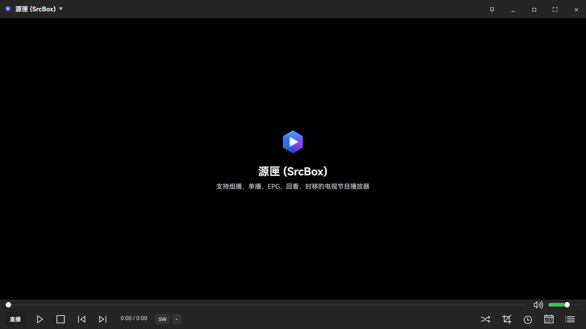
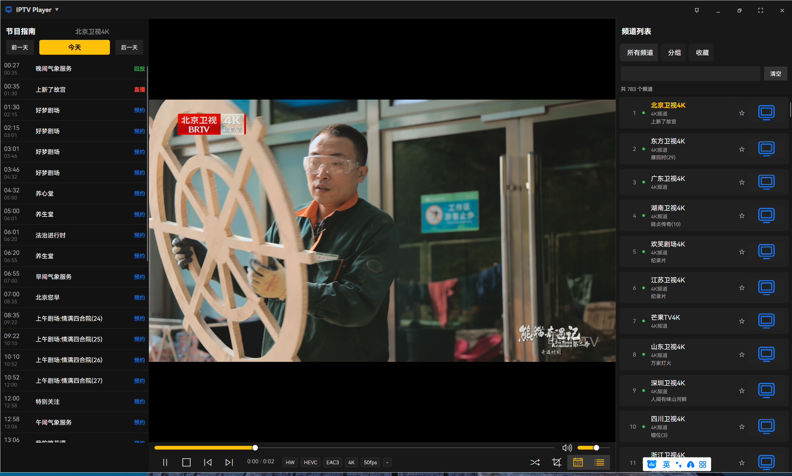
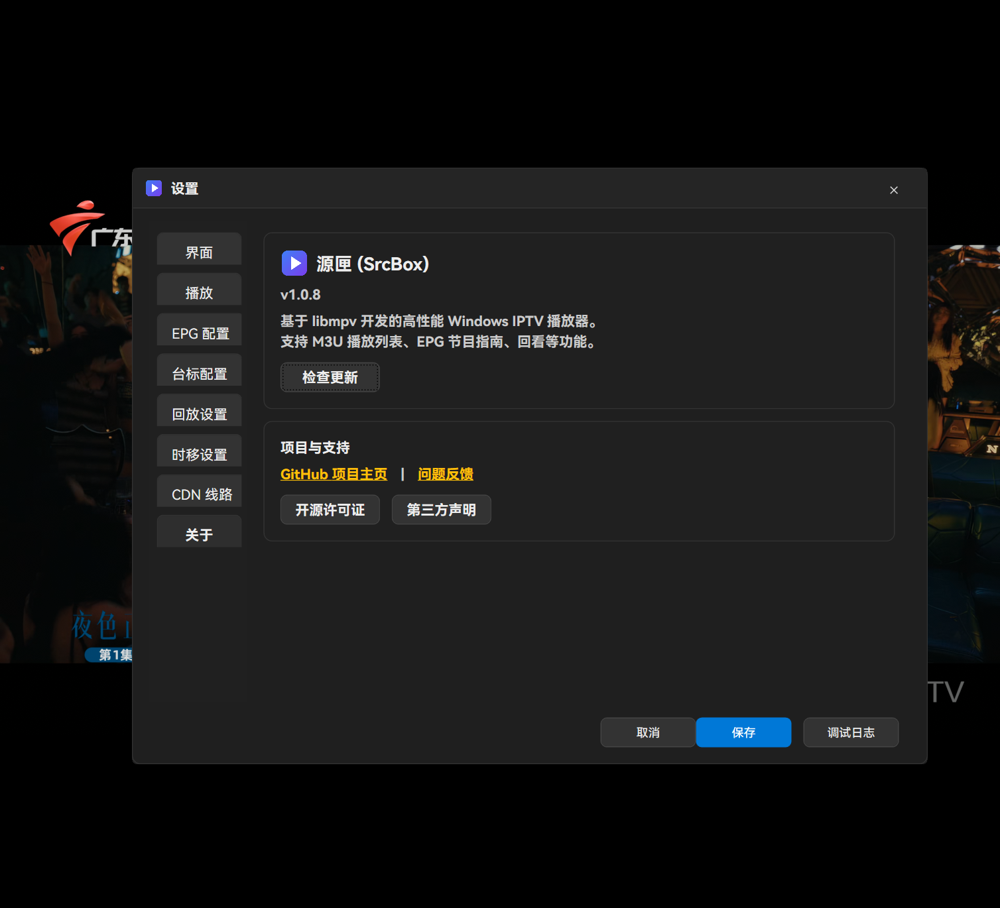

# SrcBox (Windows / WPF)

[](./LICENSE.txt)
[](https://dotnet.microsoft.com/)
[](https://www.microsoft.com/windows)
[](http://makeapullrequest.com)

[English](./README_EN.md) | [中文](./README.md)

**SrcBox** is a high-performance, modern IPTV player designed for the Windows platform.

Built on the powerful **libmpv** playback core and combined with a modern **WPF** interface, it delivers a smooth and stable live viewing experience. It supports core features like M3U playlists, EPG (Electronic Program Guide), and Catchup (Replay), while offering deep optimizations for IPTV scenarios (such as FCC fast channel switching and UDP multicast optimization), making it the ideal choice for watching live TV on your PC.

---

> **Disclaimer**:
>
> 1. All videos, screenshots, and demonstrations shown on this page are for **functional demonstration purposes only** and are not actual playable or available media resources.
> 2. This project **does not provide any m3u playlist files or the channel data contained therein**, nor is it responsible for third-party data sources.
> 3. SrcBox is merely an open-source player tool; users must find legal playback sources themselves. Please comply with local laws and regulations.

## Table of Contents

- [Overview](#overview)
- [Features & Changelog](#features--changelog)
  - [Core Playback](#core-playback)
  - [IPTV Specifics](#iptv-specifics)
  - [Fullscreen & Overlay](#fullscreen--overlay)
- [Roadmap](#roadmap)
- [Internationalization](#internationalization)
- [Interface & Interaction](#interface--interaction)
- [Configuration & Parameters](#configuration--parameters)
- [libmpv Engine](#libmpv-engine)
- [Development Guide](#development-guide)
  - [Prerequisites](#prerequisites)
  - [Build & Run](#build--run)
  - [Troubleshooting](#troubleshooting)
  - [Testing & Contribution](#testing--contribution)
- [Screenshots](#screenshots)

---

## Overview

**SrcBox** uses `libmpv-2.dll` as its playback core, hosting the video window via `WindowsFormsHost`. It provides IPTV channel list, EPG, catchup, timeshift, recording, and upload queue capabilities.

- Entry Window: [MainWindow.xaml](./MainWindow.xaml)
- libmpv Wrapper: [MpvPlayer.cs](./MpvPlayer.cs)
- M3U Parser: [Services/M3UParser.cs](./Services/M3UParser.cs)
- EPG Service: [Services/EpgService.cs](./Services/EpgService.cs)
- Main playback state: [Architecture/Presentation/Mvvm/MainWindow/MainShellViewModel.cs](./Architecture/Presentation/Mvvm/MainWindow/MainShellViewModel.cs)

---

## Technical Architecture

This project is developed using **C# / WPF**. The core architecture is as follows:

- **UI Layer**: Built with WPF (ModernWpf), providing a smooth and modern user experience.
- **Architecture Layer**: `Architecture/` is split into Application / Platform / Presentation, with modular playback and settings flows.
- **Interop Layer**: Encapsulates libmpv calls via `MpvPlayer.cs` and `MpvPlayerEngineAdapter`.
- **Rendering Layer**: Uses `WindowsFormsHost` to host a Win32 window handle, embedding mpv's rendering output into the WPF interface to bypass WPF's native media element limitations.
- **Service Layer**:
  - `M3UParser`: High-performance regex-based parser supporting complex M3U extended tags.
  - `EpgService`: Asynchronous EPG loading and in-memory caching based on `XmlSerializer`.

### Project Structure

```text
📂 SrcBox
├── 📂 Architecture    # Layered modules (Application/Platform/Presentation)
├── 📂 Services        # Core services (M3U/EPG/Recording/WebDAV/Notifications)
├── 📂 Controls        # Drawers and dialogs (EPG/Recording/Timeshift/Upload Queue)
├── 📂 Resources       # Localization and theme resources
├── 📂 Tests           # MSTest automation project
├── 📄 MainWindow.*.cs # Split main window logic
└── 📄 MpvPlayer.cs    # libmpv wrapper
```

---

## Features & Changelog

Version note: verifiable Git tags in this repository are `1.0.1` to `1.1.2`; the current branch describes as `1.1.2-6-gedf98b6`, while the project version is `1.1.4` (see `LibmpvIptvClient.csproj` / `setup.iss`). The table only keeps tag-verifiable mappings; items not mappable to a released tag are marked as “Post-1.1.2 (untagged)”.

### Core Playback

| Feature | Description | Params/Example | Changelog |
| :--- | :--- | :--- | :--- |
| **Playback Control** | Play/Pause, Stop, Seek, Fast Forward/Rewind | No default hotkeys yet; mouse supported | Since 1.0.1 |
| **Volume Control** | Slider adjustment, mute support | Range 0-100 | Since 1.0.7 |
| **Status Indicators** | Live/Replay/Timeshift status in overlay | Auto-detection | Since 1.0.5 |
| **Scheduled Reminder & Auto Play** | Program reminder and scheduled autoplay policy | Supports “remind-only / auto-play” modes | Since 1.1.2 |
| **Minimal Mode** | Compact player window mode with dedicated interactions | Synchronized behavior in window/fullscreen states | Post-1.1.2 (untagged) |

### IPTV Specifics

| Feature | Description | Params/Example | Changelog |
| :--- | :--- | :--- | :--- |
| **M3U Parsing** | Local/Remote M3U, UTF-8/GB18030 compatible | Supports `#EXTINF` attributes | Since 1.0.1 |
| **EPG** | XMLTV (gz) support, day switching | Auto-match `tvg-id` | Since 1.0.1 |
| **Catchup (Replay)** | Template-based catchup URL generation | `{utc:yyyyMMddHHmmss}` etc. | Since 1.0.1 |
| **Timeshift** | Seek back in live stream history | Depends on `catchup-source` | Since 1.0.2 |
| **Channel Mgmt** | Grouping, Search, Favorites, History | Favorites and history are persisted locally | Group/Search/Favorites: since 1.0.1; History: since 1.0.4 |
| **FCC/UDP** | Fast Channel Change & Multicast optimization | Toggle in Settings | Since 1.0.1 |
| **Recording & Upload** | Local recording, WebDAV upload, upload queue | Local/remote save modes | Post-1.1.2 (untagged) |

### Fullscreen & Overlay

- **Double-click Fullscreen**: Toggle fullscreen by double-clicking the video area.
- **Overlay Bar**: Auto-shows at bottom on mouse move; supports controls & EPG toggle.
- **Side Drawer**: Auto-shows channel list (right) or EPG (left) on mouse hover near edges.

---

## Roadmap

We are dedicated to continuously improving the IPTV viewing experience. Here are our future plans and completed features:

### Future Plans
- [ ] **AI Recommendation**: Personalized content suggestions based on viewing habits.
- [ ] **Multi-view**: Picture-in-Picture (PiP) and Mosaic view support.
- [ ] **Cloud PVR**: Remote recording to connected cloud storage.
- [ ] **Advanced A/V**: HDR10+ dynamic metadata support, 8K 120fps decoding optimization.
- [ ] **Interactive Features**: Voice barrage (Speech-to-Text), low-latency cloud gaming entry.
- [ ] **Copyright Protection**: Blockchain-based copyright verification.
- [ ] **Test Coverage Expansion**: Add more unit tests for playback state, recording index, and EPG synchronization.
- [ ] **Recording UX Improvements**: Improve in-progress metadata sync and remote metadata consistency.
- [ ] **Playback Pipeline Optimization**: Further reduce zap latency and improve weak-network resilience.
- [ ] **Source Governance**: Improve source health checks, fallback policies, and observability logs.

### Completed Features
- [x] **Timeshift**: Replay-based timeshifting via `catchup-source` with real-time seeking.
- [x] **EPG**: XMLTV (gz) parsing and display.
- [x] **Catchup**: Template-based automatic replay URL generation.
- [x] **M3U Parsing**: Local/Remote playlist support with `#EXTINF` attributes.
- [x] **Channel Mgmt**: Grouping, search, and favorites.
- [x] **Live Optimization**: FCC fast switching, UDP multicast optimization, auto-source switching.
- [x] **Hardware Decoding**: Enabled `d3d11va` by default.
- [x] **Recording**: Local recording, recording index, upload queue, and WebDAV integration.
- [x] **Scheduling**: Program reminders, reminder list, and scheduled autoplay policy.
- [x] **Minimal Mode**: Compact player mode, top-bar interactions, and state synchronization across window/fullscreen.
- [x] **UI/UX**: Fullscreen overlay, side drawer, multi-language support (ZH/EN/ZH-TW/RU).

---

## Internationalization

This project supports multi-language switching (currently Simplified Chinese, Traditional Chinese, English, Russian).

For detailed internationalization guides and how to contribute translations, please refer to the **[Internationalization Documentation](https://srcbox.top/en/i18n)**.

### Quick Contribution

1.  Locate `Strings.en-US.xaml` in the `Resources/` directory.
2.  Copy and rename it to the target language code (e.g., `Strings.fr-FR.xaml`).
3.  Translate the content and submit a Pull Request.

---

## Interface & Interaction

### Main Interface

- **Top Bar**: Menu buttons (Open File, Settings, etc.) and window controls.
- **Center**: Video playback area.
- **Bottom/Overlay**: Progress bar, volume, toggles (EPG/List).

### Shortcuts

Currently relies mostly on mouse interaction.
- **Esc**: Exit fullscreen.
- **Double-click**: Toggle fullscreen.

---

## Configuration & Parameters

### `user_settings.json`

Located in the application run directory, stores user preferences.

```json
{
  "Hwdec": true,              // Hardware decoding
  "SourceTimeoutSec": 3,      // Source switch timeout (seconds)
  "TimeshiftHours": 2,        // Timeshift duration (hours)
  "Language": "en-US",        // Interface language
  "ThemeMode": "Dark"         // Theme mode (Dark/Light/System)
}
```

---

## libmpv Engine

This project depends on `libmpv-2.dll`.

- **Hardware Decoding**: `d3d11va` is enabled by default.
- **No Audio**: Some IPTV sources have slow audio probing; `probesize=32` is set to speed up start, which might cause brief silence.

---

## Development Guide

### Prerequisites

- **OS**: Windows 10 / 11 (x64)
- **IDE**: Visual Studio 2022 or JetBrains Rider
- **SDK**: .NET 8.0 SDK
- **Dependency**: `libmpv-2.dll` (included in repository root and copied to output on build)

### Build & Run

```powershell
# Restore dependencies
dotnet restore

# Build (Debug)
dotnet build

# Run
dotnet run

# Tests
dotnet test .\Tests\LibmpvIptvClient.Tests.csproj
```

**Note**: If `libmpv-2.dll` is missing at runtime, the app will fail to start; by default the repository copy is copied during build.

### Troubleshooting

| Issue | Possible Cause | Solution |
| :--- | :--- | :--- |
| **Crash on startup** | Missing `libmpv-2.dll` | Download x64 dll and place in run dir |
| **Video but no audio** | Audio probe timeout | Normal optimization; try switching tracks or restarting |
| **EPG "No Data"** | Network or format issue | Check XMLTV URL accessibility and GZIP format |
| **Settings not saving** | Permission denied | Ensure write permission to app directory |

### Testing & Contribution

#### Workflow

1. **Fork** the repository.
2. Create a feature branch: `git checkout -b feature/AmazingFeature`.
3. Commit changes: `git commit -m 'feat: Add some AmazingFeature'` (Follow [Conventional Commits](https://www.conventionalcommits.org/)).
4. Push branch: `git push origin feature/AmazingFeature`.
5. Submit a **Pull Request**.

#### Code Style

- Follow existing C# style (K&R / Allman hybrid, see .editorconfig if available).
- Ensure UI changes adapt to both Dark and Light themes.

#### Performance Benchmarks

- **CPU Usage**: < 15% @ 1080p (i5-8250U baseline).
- **Memory**: < 500MB during stable playback.
- **Startup**: < 2 seconds (cold start).

---

## Privacy & Security

- **Local First**: All playlists, EPG caches, and user configurations (favorites, settings) are stored locally on your device (`user_settings.json`) and are never uploaded to any cloud server.
- **Network Activity**: The application only initiates network connections when requesting your specified M3U/EPG URLs, checking for updates (GitHub API), or downloading CDN resources.

---

## Screenshots

- Main Interface  
  

- Fullscreen Overlay  
  

- Settings  
  
